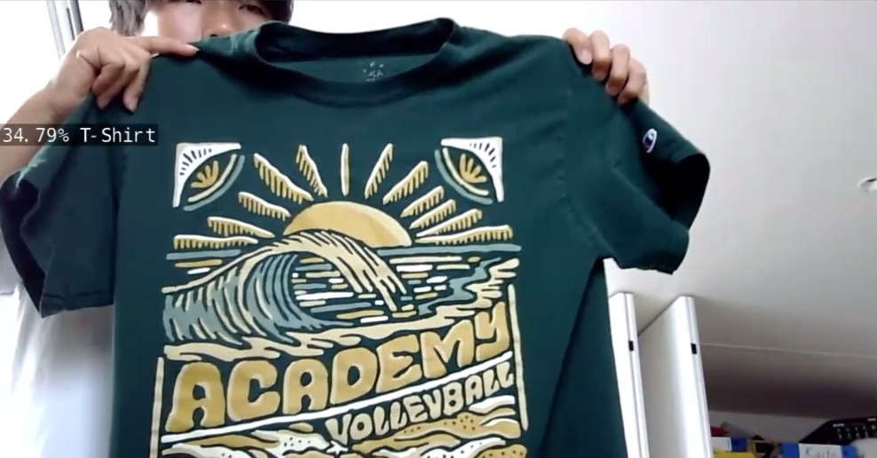

# ai_nvdia
# Clothes Detection

 The goal of this project is to create an image classification model that can accurately detect the type of clothes/attire presented to it(limited to 1 item) within an image

## The Algorithm

The base model used for this project is resnet18 image detection, which is a model that scans and analyzes images in small segments. By doing so, the model is able to recognize patterns, and through multiple epochs of training the model is able to connect a certain pattern to a certain attribute, effectively increasing its ability to detect whatever is in the image. By specifying our data and detection targets down to clothes, the model is trained in a way that makes it a unique "clothing detection" model. 

## Running this project

1. Retrieve a data set of clothes images, for this project from "https://www.kaggle.com/datasets/agrigorev/clothing-dataset-full"
2. Install jetson-inference
3. Move into directory where both the model and script are in through the terminal, run "project.py" through the terminal as well
4. While the script is running, show the camera pieces of clothing, then, click ENTER to save the datum
5. After classifying and recording the clothes, input Q then ENTER to save the data into a JSON file and exit the code

### use this line to run the actual model
imagenet.py --model=resnet18.onnx --input_blob=input_0 --output_blob=output_0 --labels=labels.txt test_photos/shoes.jpg output.jpg

# webcam ver
imagenet.py --model=resnet18.onnx --input_blob=input_0 --output_blob=output_0 --labels=labels.txt /dev/video webrtc://@:8554/output
###

[View a video explanation here](video link)
